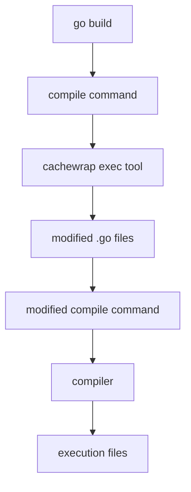

# Technical Design

## Summary

CacheWrap is a compile-time instrumentation tool for automatic function result caching in Go applications. Inspired by loongsuite-go-agent's battle-tested DST-based instrumentation approach, CacheWrap provides zero-overhead caching through annotation-based code injection, eliminating the need for manual cache management boilerplate.

## 1. Problems & Objectives

### 1.1 Background

Modern applications frequently implement caching patterns to reduce expensive operations (database queries, API calls, computations). Traditional approaches suffer from:

**Manual Boilerplate:**
```go
func (r *Repository) GetByID(id string) (*Customer, error) {
    // Manual cache checking - repeated across hundreds of functions
    cacheKey := fmt.Sprintf("GetByID:%s", id)
    if cached, ok := r.cache.Get(cacheKey); ok {
        if customer, ok := cached.(*Customer); ok {
            return customer, nil
        }
    }
    
    // Actual business logic
    result, err := r.db.QueryCustomer(id)
    
    // Manual cache storage
    if err == nil {
        r.cache.Set(cacheKey, result)
    }
    
    return result, err
}
```

**Problems:**
1. **Repetitive** - 10+ lines of cache logic per function
2. **Error-prone** - Easy to forget cache.Set() or mistype keys
3. **Hard to maintain** - Changing cache strategy requires editing hundreds of functions

### 1.2 Objectives

- To reduce the boilerplate code for caching in Go applications.
- To maintain zero runtime overhead.
- To preserve original source line numbers (debugger compatibility).
- To support extensible cache instances.

## 2. Architecture

### 2.1 High-Level Flow
CacheWrap employs **compile-time code injection** using Go's `-toolexec` mechanism and DST (Decorator Syntax Tree) manipulation.



### 2.2 Detailed Flow

#### Step 1: Developer Source Code
```go
// cachewrap[@redisCache]: id
func GetByID(id string) (*Customer, error) {
    return db.Query(id)
}
```

#### Step 2: Build Command
```bash
go build -toolexec="cachewrap" .
```

#### Step 3: CacheWrap Tool (Compile-time)

CacheWrap performs the following transformations:

1. **Parse DST** → Find `// cachewrap` annotations
2. **Inject cache checking code** → Add cache lookup logic
3. **Add line directives** → Preserve original line numbers
4. **Generate instrumented source** → Output modified Go code

#### Step 4: Instrumented Code (Compiled)
```go
func GetByID(id string) (retVal0 *Customer, retVal1 error) {
    //line :1
    cacheInst := cache.GetCache("redisCache")
    
    if cacheInst != nil {
        if cached, ok := cacheInst.Get(key); ok {
            return cached.(*Customer), nil
        }
        defer func() { cacheInst.Set(key, retVal0) }()
    }
    
    //line repo.go:37:2  ← Original line restored
    return db.Query(id)
}
```

#### Step 5: Compiled Binary

Final executable with cache instrumentation embedded at compile-time

## 3. Design Decisions

## 3.1 How to parse and manipulate Go source code?

**Problem:** How to manipulate Go source code while preserving formatting?

**Options:**
1. **go/ast** - Standard library, well-documented. But loses comments and formatting.
2. **dst (Decorator Syntax Tree)** - External dependency, but preserves comments and formatting.
3. **Text manipulation** - Simple, but fragile and error-prone.

**Decision:** 

Use dst (Decorator Syntax Tree).

## 3.2 How to preserve original line numbers?

**Problem:** Injected code shifts line numbers, breaking debuggers and stack traces.

**Solution:** Use `//line` directives.

## 3.3 How to design extensible cache instances?

**Problem:** How do developers inject custom cache implementations without modifying struct definitions?

### Option 1: Global Singleton (Like OpenTelemetry)

- **Pros:** Simple, matches OpenTelemetry pattern  
- **Cons:** Single cache for entire application  

### Option 2: Injectable Struct Fields

```go
type Repository struct {
    Cache cache.Cache  // Developer adds manually
}

// cachewrap[r.Cache]: id
func (r *Repository) GetByID(id string) (*Customer, error) {}
```

**Pros:** Explicit, per-instance control  
**Cons:** Requires modifying every struct  

### Option 3: Auto-Injection (Like Loongsuite)

**Concept:** Automatically inject `cachewrap_auto_cache` field into structs.

```go
// Developer writes:
type Repository struct {
    data map[string]*Customer
}

// CacheWrap transforms to:
type Repository struct {
    data map[string]*Customer
    cachewrap_auto_cache cache.Cache  // ← AUTO-INJECTED
}
```

**Critical Flaw Discovered:**
```go
// Developer's source code:
repo.cachewrap_auto_cache = cache.NewRedis()  // ← COMPILE ERROR!
// Field doesn't exist in source, only after compilation!
```

**Analysis:** While loongsuite successfully uses this for `runtime.g` (internal Go runtime struct accessed via `go:linkname`), it's **not suitable for user structs** because:
1. Developers can't reference auto-injected fields in source code
2. Initialization becomes complex (requires reflection or magic)
3. IDE autocomplete doesn't see the field

### Option 4: Named Cache Registry (SELECTED)

```go
// Registration (once at app startup)
func main() {
    cache.RegisterCache("redisCache", cache.NewRedisCache("localhost:6379"))
    cache.RegisterCache("memcached", cache.NewMemcachedCache("localhost:11211"))
}

// Usage (zero struct modification)
type UserRepo struct {
    db *sql.DB  // No cache field!
}

// cachewrap[@redisCache]: id
func (r *UserRepo) GetByID(id string) (*User, error) {
    return r.db.QueryUser(id)
}

type ProductRepo struct {
    api *http.Client  // Different struct, different cache!
}

// cachewrap[@memcached]: id
func (p *ProductRepo) GetByID(id string) (*Product, error) {
    return p.api.FetchProduct(id)
}
```

**Generated Code:**
```go
func (r *UserRepo) GetByID(id string) (retVal0 *User, retVal1 error) {
    cacheInst := cache.GetCache("redisCache")  // ← Runtime lookup by name
    if cacheInst != nil {
        cacheKey := cache.MakeCacheKey("GetByID", id)
        if cached, ok := cacheInst.Get(cacheKey); ok {
            return cached.(*User), nil
        }
        defer func() {
            if retVal1 == nil && retVal0 != nil {
                cacheInst.Set(cacheKey, retVal0)
            }
        }()
    }
    return r.db.QueryUser(id)
}
```

**Pros:**
- No struct modification required
- Different caches for different purposes
- Runtime configuration (switch Redis ↔ Memcached without recompilation)
- Testable (swap with mock cache)
- Clear separation of concerns

**Trade-offs:**
- Runtime map lookup overhead (~10ns)
- Requires registration at startup
- No compile-time verification of cache names


### 3.4 How to cache return values?

**Problem:** How cachewrap knows which values to cache?

**Solution:** Convert all cached functions to use named return values (retVal0, retVal1, etc.), and use `defer` to cache the return value.

**Before:**
```go
func GetByID(id string) (*Customer, error) {
    return db.Query(id), nil
}
```

**After Instrumentation:**
```go
func GetByID(id string) (retVal0 *Customer, retVal1 error) {
    defer func() {
        if retVal1 == nil && retVal0 != nil {
            cache.Set(key, retVal0)  // ← Access named returns in defer
        }
    }()
    return db.Query(id), nil
}
```

**Rationale:** Go's defer can only access named return values. This mirrors how loongsuite handles return value access in OnExit hooks.
